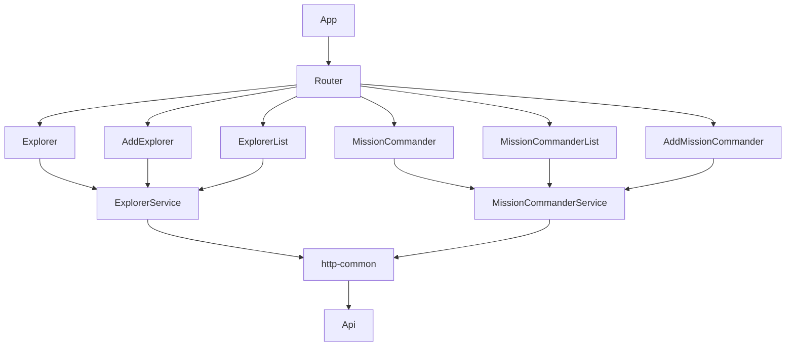

# Cliente web - App VueJs

Con el objetivo de facilitar la interacción con la api anteriormente desarrollada [ApiConPrismaDB](https://github.com/andresGuevaraRojas/ApiConPrismaDB) se opto por desarrollar una aplicación web con VueJs.

El siguiente diagrama muestra el diseño general de la aplicación.

